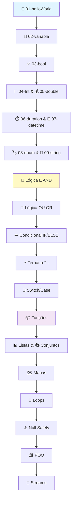

# 🧠 Lógica Essencial e Programação com Dart

---

## 🌟 Visão Geral do Curso

Este repositório é o material prático do curso **Lógica Essencial e Programação com Dart**.

Ele foi criado para construir uma ponte sólida entre a **Lógica Formal/Acadêmica** e sua **Aplicação Prática em Dart**, a linguagem por trás do Flutter.

> 💡 **Conteúdo do curso:**
>
> - ✅ Conceitos fundamentais de lógica proposicional
> - ✅ Estruturas de dados e tipos em Dart
> - ✅ Operadores booleanos e expressões lógicas
> - ✅ Estruturas de controle de fluxo
> - ✅ Programação funcional e orientada a objetos
> - ✅ Boas práticas e padrões de código

## 🗺️ Roteiro e Estrutura do Repositório

O conteúdo está organizado de forma sequencial, garantindo que a base do Dart seja sólida antes de avançar para a Lógica Aplicada.

---

## 📚 Módulos de Fundamentos (Dart Básico)

Estas pastas cobrem os tipos de dados e conceitos básicos que formam as "premissas" do seu código:

|  #  | Módulo          | Tópico                   | Descrição Rápida                             | Acesse                                             |
| :-: | :-------------- | :----------------------- | :------------------------------------------- | :------------------------------------------------- |
| 1️⃣  | `01-helloWorld` | 👋 Sintaxe Inicial       | O ponto de partida de qualquer argumento.    | [📖 Explorar](01-helloWorld/01_introducao_dart.md) |
| 2️⃣  | `02-variable`   | 📝 **Variáveis e Tipos** | A definição de termos e entidades.           | [📖 Detalhes](02-variable/02_variable.md)          |
| 3️⃣  | `03-bool`       | ✅ **Booleano**          | O fundamento da Lógica: Verdadeiro ou Falso. | [📖 Detalhes](03-bool/03_bool.md)                  |
| 4️⃣  | `04-Int`        | 🔢 **Números Inteiros**  | Operações, tipos e conversões.               | [📖 Detalhes](04-Int/04_int.md)                    |
| 5️⃣  | `05-double`     | 💰 **Números Decimais**  | Pontos flutuantes e precisão.                | [📖 Detalhes](05-double/05_double.md)              |
| 6️⃣  | `06-duration`   | ⏱️ **Duração**           | Lógica de Intervalos de Tempo.               | [📖 Explorar](06-duration/)                        |
| 7️⃣  | `07-datetime`   | 📅 **Data e Hora**       | Lógica de Sequência Temporal.                | [📖 Explorar](07-datetime/)                        |
| 8️⃣  | `08-enum`       | 🏷️ **Enumerações**       | Lógica de Conjuntos Fixos e Exclusivos.      | [📖 Explorar](08-enum/)                            |
| 9️⃣  | `09-string`     | 📄 **Strings**           | Manipulação de textos e interpolação.        | [📖 Detalhes](09-string/09_string.md)              |

---

## ✨ Módulo Central: Lógica Proposicional Aplicada

Aqui, a lógica formal é traduzida diretamente para as decisões que o seu código toma:

|   Operador Lógico   | Conceito Formal      | Implementação em Dart | Arquivo                              | Descrição                                              |
| :-----------------: | :------------------- | :-------------------- | :----------------------------------- | :----------------------------------------------------- | -------------------------------- | ------------------------------------------------------------ |
|      🔗 **E**       | Conjunção ($\land$)  | Operador `&&`         | [logica_and.dart](logica_and.dart)   | Verdadeiro quando **ambas** condições são verdadeiras. |
|      🔀 **OU**      | Disjunção ($\lor$)   | Operador `            |                                      | `                                                      | [logica_or.dart](logica_or.dart) | Verdadeiro quando **uma ou mais** condições são verdadeiras. |
|      ➡️ **SE**      | Implicação ($\to$)   | Estrutura `if/else`   | [condicional.dart](condicional.dart) | Executa bloco **se** a condição for verdadeira.        |
|   ⚡ **SE Curto**   | Condicional Ternária | Expressão `? :`       | [ternario.dart](ternario.dart)       | Versão compacta de `if/else` para atribuições.         |
|  🎯 **Múltiplas**   | Decisão Múltipla     | Estrutura `switch`    | [switch_case.dart](switch_case.dart) | Escolhe entre **várias opções** baseado em um valor.   |
| 🔬 **Profundidade** | Lógica Avançada      | Implementações Custom | [logic/](logic/)                     | Conceitos formais avançados e combinações complexas.   |

---

## 🛠️ Tópicos Avançados e Estruturas

Estruturas complexas que dependem de uma lógica interna refinada:

|  #  | Tópico          | Conceito                | Descrição                               | Pasta                             |
| :-: | :-------------- | :---------------------- | :-------------------------------------- | :-------------------------------- |
| 📦  | **Funções**     | 🎯 Modularidade         | Regras de escopo, parâmetros e retorno. | [functions/](functions/)          |
| 📊  | **Listas**      | 🔀 Sequências Ordenadas | Coleções de dados indexados e mutáveis. | [📖 Detalhes](10-list/10_list.md) |
| 🎭  | **Conjuntos**   | 🔗 Unicidade            | Coleções sem duplicatas.                | [set/](set/)                      |
| 🗺️  | **Mapas**       | 🔍 Pares Chave-Valor    | Estrutura de dados associativa.         | [map/](map/)                      |
| 🔄  | **Loops**       | ⏰ Repetição e Iteração | Estruturas `for`, `while`, `forEach`.   | [loop/](loop/)                    |
| ⚠️  | **Null Safety** | 🛡️ Segurança de Tipos   | Tratamento seguro de valores nulos.     | [nullsafety/](nullsafety/)        |
| 🏛️  | **POO**         | 🎯 Orientação a Objetos | Classes, herança, polimorfismo.         | [poo/](poo/)                      |
| 🌊  | **Streams**     | 💧 Fluxo de Dados       | Processamento assíncrono de sequências. | [stream/](stream/)                |

---

## 🎓 Como Usar Este Repositório

### 🔍 Explorando os Tópicos

Cada módulo tem uma estrutura consistente:

```
Pasta do Módulo/
├── arquivo.dart          # Código fonte executável
├── arquivo.md            # Documentação detalhada
└── (exemplos adicionais) # Variações e casos especiais
```

**Dicas de navegação:**

1. **Leia a Documentação Primeiro** 📖  
   Os arquivos `.md` contêm explicações teóricas e exemplos.

2. **Experimente o Código** 💻  
   Execute os arquivos `.dart` para ver a lógica em ação.

3. **Modifique e Teste** 🧪  
   Altere o código, adicione casos de teste, experimente variações.

### 📎 Acessando Documentação de Tópicos Específicos

Click nos links das tabelas acima para acessar documentação detalhada de cada tópico:

- **[Variáveis](02-variable/02_variable.md)** - Entenda tipos, modificadores e boas práticas
- **[Booleano](03-bool/03_bool.md)** - Verdadeiro/Falso e operações lógicas
- **[Números Inteiros](04-Int/04_int.md)** - Operações, conversões e tipos
- **[Números Decimais](05-double/05_double.md)** - Ponto flutuante e precisão
- **[Strings](09-string/09_string.md)** - Manipulação de texto, interpolação e formatação
- **[Lógica E/OU](logica_and.dart)** - Operadores booleanos fundamentais
- **[Condicional](condicional.dart)** - Estruturas if/else
- **[Switch/Case](switch_case.dart)** - Decisões múltiplas
- **[Ternário](ternario.dart)** - Expressões condensadas

---

## 💻 Requisitos e Como Executar

### ✅ Pré-requisitos

- **Dart SDK** (versão 3.x ou superior) - [Instale aqui](https://dart.dev/get-dart)
- **Editor:** VS Code com [Extensão Dart](https://marketplace.visualstudio.com/items?itemName=Dart-Code.dart-code)

### 🚀 Executando Exemplos

1. **Clone o Repositório:**

   ```bash
   git clone https://github.com/balta/Logica-Dart.git
   cd Logica-Dart
   ```

2. **Execute um Exemplo Básico:**

   ```bash
   # Exemplo de Variáveis (Fundamentos)
   dart run 02-variable/02-variable.dart

   # Exemplo de Lógica (Módulo Central)
   dart run logica_and.dart
   dart run logica_or.dart

   # Exemplo Avançado (Estruturas)
   dart run functions/exemplo.dart
   dart run list/exemplo.dart
   ```

3. **Executar Todos os Arquivos de uma Pasta:**
   ```bash
   # Execute todos os exemplos de uma pasta
   for file in 02-variable/*.dart; do dart run $file; done
   ```

### 📝 Lendo a Documentação

Para entender os conceitos em detalhes, abra os arquivos `.md`:

```bash
# Visualizar documentação (macOS/Linux)
cat 02-variable/02_variable.md

# Ou abra diretamente no VS Code
code 02-variable/02_variable.md
```

---

## 🎯 Roteiro de Aprendizado Recomendado

Siga esta sequência para melhor compreensão:



---

## 📚 Referências e Recursos

| Recurso               | Link                                                                                      |
| :-------------------- | :---------------------------------------------------------------------------------------- |
| 🌐 Dart Official Docs | [dart.dev/guides](https://dart.dev/guides)                                                |
| 🎥 Flutter & Dart     | [flutter.dev](https://flutter.dev)                                                        |
| 📖 Dart Language Tour | [dart.dev/tour](https://dart.dev/tour)                                                    |
| 🧮 Lógica Formal      | [Khan Academy - Logic](https://www.khanacademy.org/computing/computer-science/algorithms) |

---

## 👨‍💼 Autor
